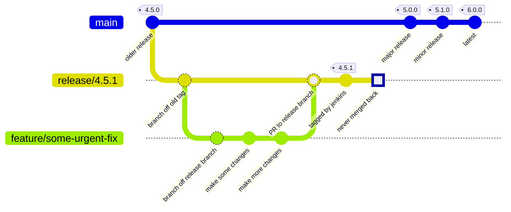

# Documentation for project maintainers (MDTP Platform UI and Design Resources teams)

## Publishing the hmrc-frontend WebJar locally

In order to make the hmrc-frontend assets easy to consume in a JVM environment,
the npm `build:webjar` task builds a JVM compatible webjar. This webjar is published to HMRC's open
artefact repository by an internal automated deployment process and is a dependency of
[hmrc/play-frontend-hmrc](https://www.github.com/hmrc/play-frontend-hmrc).

When testing changes in conjunction with `play-frontend-hmrc` and consuming frontend microservices,
it's possible to publish the hmrc-frontend webjar locally as follows. You will need Java
and [Maven](https://maven.apache.org/install.html) installed.

```shell script
npm run build:package
npm run build:webjar
npm run publish-local:webjar
```

You can then reference the webjar in the `LibDependencies.scala` file in `play-frontend-hmrc` as follows:

```sbt
"uk.gov.hmrc.webjars" % "hmrc-frontend" % "X.Y.Z"
```

You will also need to configure your `build.sbt` resolvers to look in your local Maven repository:

```sbt
  .settings(
    ...
    resolvers += Resolver.mavenLocal,
    ...
  )
```

Further documentation on the webjar mechanism can be found:

* https://www.webjars.org/documentation
* https://www.playframework.com/documentation/2.8.x/AssetsOverview

## Creating a patch release for an earlier version

Occasionally, we need to release a patch to earlier major versions of the library, to fix critical issues
or make mandatory changes for services on earlier versions that can't easily upgrade to the latest.
An example of this was the mandated switch to use the Tudor Crown branding following the accession of King Charles III.

We use the following workflow for patch releases:
1. Create a release branch for the new version, based on the tag of the older version, eg.
   `git checkout -b release/v4.5.1 tags/v4.5.0`
2. Push release branch to github, eg.
   `git push -u origin release/v4.5.1`
3. Create a feature branch off the release branch, for the required changes, eg.
   `git checkout -b PLATUI-999-my-critical-changes`
4. Bump the patch version on your local feature branch
   `npm version patch`
5. Make and test the required changes on your local feature branch
6. Once you're happy with your changes, push them up to GitHub
   `git push -u origin PLATUI-999-my-critical-changes`
7. Raise a PR *from the feature branch into the release branch* (to get the changes approved before building the new version), eg. using the GitHub CLI
   `gh pr create -B release/v4.5.1`
8. Once approved and merged, do a branch build of the release branch in Jenkins - this will build and tag the release, eg. v4.5.1,
   and publish it to artifactory ready for consumption
9. Eventually, delete the release branch so that there's just the tag left behind



## Consider if a deprecation warning needs a change request

Sometimes we may get deprecation warnings, but we might not always want to resolve this with a change request. This is because these changes can be breaking changes for the consumers of our library who reuse our uncompiled sass. The largest group of which are prototypes. Instead, you can suppress the deprecation by adding the name of the deprecation to the `silenceDeprecations` list and documenting the suppression.

## Double check if the govuk-crest needs updating

Under `src/assets/images/`, there is a png of the [govuk-crest](src/assets/images/govuk-crest.png) and [govuk-crest-2x](src/assets/images/govuk-crest-2x.png). For the most part, it's unlikely we will need to change this image, but at some point in the future, you may need to update this. This can be done by taking any software that can take and convert an svg file into the png format.

### How-to regenerate 1x and 2x versions from SVG if it has been updated

If [govuk-frontend](https://github.com/alphagov/govuk-frontend/) provides an updated svg file for [govuk-crest](https://github.com/alphagov/govuk-frontend/blob/main/dist/assets/images/govuk-crest.svg), you can use any software to convert the file to png format. For vector-based illustrations (svg files), you could use [Inkscape](https://inkscape.org/), or any other vector-based software that allows exporting to the png file format.

`govuk-crest-2x` may not be included in [govuk-frontend](https://github.com/alphagov/govuk-frontend/). If that's the case, you will need to take the govuk-crest file and upscale it yourself, using any vector-based software that allows you to do so. Then you will need to export it as a png file.

### Why do we have these?

These are here for services and applications that need a png format for the crest, such as emails, which cannot utilise the svg file format.

## Keeping a record of decisions

We are using MADRs to record significant decisions in this service. To find out more
visit [MADR](https://github.com/adr/madr)

See our [decision log](docs/adr/index.md) for a list of past decisions.

### How to prepare a new decision

1. Copy [template.md](docs/adr/template.md) as NNNN-title-of-decision.md, and fill
   in the fields. Do not feel you have to fill in all the fields, only fill in fields
   that are strictly necessary. Some decisions will merit more detail than others.

1. To re-generate the [listing page for previous decisions](docs/adr/index.md)
   so it includes the new decision, run:

    ```shell script
    npm run docs:generate-decision-log-listing
    ```

